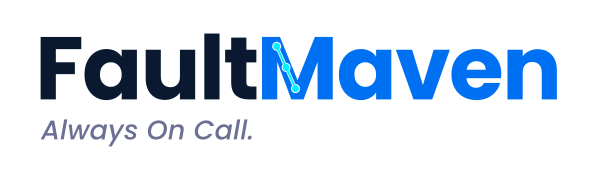

# FaultMaven Website: The AI-Powered Troubleshooting Copilot



This is the official source code for the FaultMaven website.

**FaultMaven** is the AI-Powered Troubleshooting Copilot for Modern Engineering.

**Looking for the tool itself?** Go to the [main repository](https://github.com/FaultMaven/faultmaven)

**Status**: ✨ Open Source & Available Now | [Get Started](https://github.com/FaultMaven/faultmaven#quick-start)

---

## 🌐 Live Website

**Production**: [https://faultmaven.ai](https://faultmaven.ai)

---

## 📖 About

This repository contains the FaultMaven marketing website with:

- **Product Pages**: Features, capabilities, and how FaultMaven differs from generic AI tools
- **Use Cases**: Real-world troubleshooting scenarios
- **Pricing**: Open source (free forever) vs. Enterprise Cloud
- **Roadmap**: Product vision and upcoming features
- **FAQ**: Everything you need to know about getting started

**Note**: Full product documentation is available in the [main FaultMaven repository](https://github.com/FaultMaven/faultmaven).

We welcome contributions for website improvements, typo fixes, and clarifications!

---

## 🛠 Tech Stack

- **Framework**: [Next.js 15](https://nextjs.org/) (App Router)
- **Styling**: [Tailwind CSS](https://tailwindcss.com/)
- **Language**: [TypeScript](https://www.typescriptlang.org/)
- **Package Manager**: [PNPM](https://pnpm.io/)
- **Deployment**: [Vercel](https://vercel.com/)
- **Icons**: [Lucide React](https://lucide.dev/)

---

## 🚀 Quick Start

### Prerequisites

- Node.js v18 or higher
- PNPM package manager

```bash
npm install -g pnpm
```

### Installation

```bash
# Clone repository
git clone https://github.com/FaultMaven/faultmaven-website.git
cd faultmaven-website

# Install dependencies
pnpm install

# Start development server
pnpm dev
```

Open [http://localhost:3000](http://localhost:3000) to view the site.

---

## 📁 Project Structure

```
├── src/
│   ├── app/                 # Next.js App Router pages
│   │   ├── about/           # About page
│   │   ├── blog/            # Blog section (planned)
│   │   ├── contact/         # Contact page
│   │   ├── faq/             # FAQ page
│   │   ├── pricing/         # Pricing page
│   │   ├── privacy/         # Privacy policy
│   │   ├── product/         # Product details
│   │   ├── roadmap/         # Product roadmap & vision
│   │   ├── terms/           # Terms of service
│   │   ├── use-cases/       # Use cases
│   │   ├── waitlist/        # Beta application
│   │   └── page.tsx         # Homepage
│   ├── components/          # React components
│   │   ├── icons/           # Icon components
│   │   ├── layout/          # Header, Footer
│   │   ├── sections/        # Homepage sections (Hero, Problem, etc.)
│   │   └── ui/              # Reusable UI components (Button, Card, etc.)
│   ├── lib/                 # Utility functions
│   └── types/               # TypeScript definitions
├── public/                  # Static assets
│   └── images/              # Image files
└── middleware.ts            # Next.js middleware
```

---

## 🧪 Development

### Available Scripts

```bash
# Development server with hot reload
pnpm dev

# Production build
pnpm build

# Start production server
pnpm start

# Lint code
pnpm lint

# Type checking
pnpm type-check
```

### Environment Variables

Create a `.env.local` file for local development:

```env
# API Configuration (if needed)
NEXT_PUBLIC_API_URL=https://api.faultmaven.com

# Analytics (optional)
# NEXT_PUBLIC_GA_ID=your-google-analytics-id
```

---

## 🤝 Contributing

We welcome contributions from the community! Here's how you can help:

### Ways to Contribute

1. **Documentation**: Fix typos, improve clarity, add examples
2. **Bug Reports**: Report issues or broken links
3. **Feature Requests**: Suggest improvements to the website
4. **Translations**: Help translate documentation (coming soon)

### Contribution Workflow

1. **Fork the repository**

```bash
git clone https://github.com/YOUR_USERNAME/faultmaven-website.git
cd faultmaven-website
```

2. **Create a feature branch**

```bash
git checkout -b docs/fix-typo-in-readme
# or
git checkout -b feature/add-dark-mode
```

3. **Make your changes**
   - Edit files
   - Test locally with `pnpm dev`
   - Ensure no TypeScript errors with `pnpm type-check`

4. **Commit your changes**

```bash
git add .
git commit -m "docs: fix typo in installation guide"
```

5. **Push to your fork**

```bash
git push origin docs/fix-typo-in-readme
```

6. **Open a Pull Request**
   - Go to the original repository
   - Click "New Pull Request"
   - Select your branch
   - Describe your changes

### Commit Message Convention

We follow [Conventional Commits](https://www.conventionalcommits.org/):

- `docs:` - Documentation changes
- `feat:` - New features
- `fix:` - Bug fixes
- `style:` - Code style changes (formatting, etc.)
- `refactor:` - Code refactoring
- `test:` - Adding or updating tests
- `chore:` - Maintenance tasks

Examples:
```
docs: update installation instructions
feat: add dark mode toggle
fix: resolve mobile navigation issue
```

---

## 📦 Deployment

This site is automatically deployed to Vercel:

- **Production**: Automatically deploys from `main` branch
- **Preview**: Automatically deploys from pull requests

[](https://vercel.com/new/clone?repository-url=https://github.com/FaultMaven/faultmaven-website)

### Manual Deployment

```bash
# Install Vercel CLI
npm i -g vercel

# Deploy to production
vercel --prod
```

---

## 🔗 Related Projects

The FaultMaven ecosystem includes:

- **[faultmaven](https://github.com/FaultMaven/faultmaven)** - Main repository with microservices backend (Open Source)
- **[faultmaven-dashboard](https://github.com/FaultMaven/faultmaven-dashboard)** - Web-based dashboard UI (Open Source)
- **[faultmaven-copilot](https://github.com/FaultMaven/faultmaven-copilot)** - Browser extension for incident capture (Open Source)
- **[faultmaven-deploy](https://github.com/FaultMaven/faultmaven-deploy)** - Deployment configurations and tooling (Open Source)

All FaultMaven components are Apache 2.0 licensed and fully open source.

---

## 📄 License

This project is licensed under the **Apache License 2.0** - see the [LICENSE](LICENSE) file for details.

---

## 🆘 Support

- **Documentation**: [docs.faultmaven.com](https://docs.faultmaven.com) (coming soon)
- **Email**: support@faultmaven.ai
- **Issues**: [GitHub Issues](https://github.com/FaultMaven/faultmaven-website/issues)

---

## 🙏 Acknowledgments

Built with:
- [Next.js](https://nextjs.org/)
- [Tailwind CSS](https://tailwindcss.com/)
- [Vercel](https://vercel.com/)
- [Lucide Icons](https://lucide.dev/)

---

Made with ❤️ by the FaultMaven Team
