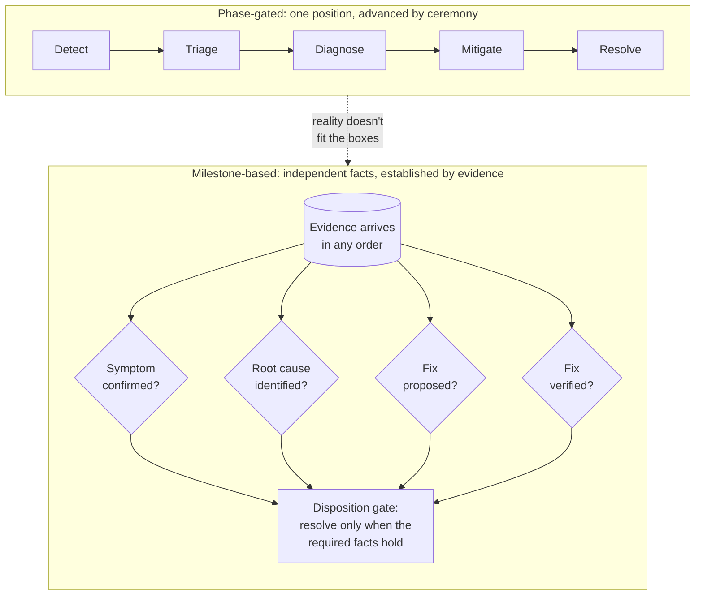

Somewhere in your team's wiki there is a diagram. It has five or six boxes with
arrows between them: **detect → triage → diagnose → mitigate → resolve**, maybe
a **postmortem** box tacked on the end. It is a good diagram. It is on the
onboarding page. It is in the incident-management tool's status dropdown.

And no real incident you have ever worked went through those boxes in order.

Think about the last bad one. The first message in the channel — "checkout is
throwing 503s" — already named the root cause, you just didn't know it yet
because it was buried under three false leads. The metric that confirmed the
symptom arrived *after* you'd already formed a hypothesis about the cause. You
mitigated before you'd diagnosed anything, because the pager doesn't wait for
your understanding to catch up. And then the "verified" fix — the one you moved
the ticket to *resolved* for — turned out to relieve the symptom while the cause
sat there waiting to reoffend at 3 a.m.

The boxes are a lie we tell ourselves for the retrospective. The retro *narrates*
the incident as a clean sequence because a clean sequence is easy to write down.
The incident itself was a scramble of evidence arriving in the wrong order and
conclusions forming out of sequence. That gap — between how we describe
investigations and how they actually run — is not a documentation nuisance. It's
a design flaw that gets baked into tools, and the tools make it worse.

## Phase-gated tools make you lie to the tool

When a process is drawn as a linear pipeline, software encodes it as a state
machine: you are *in* triage, or *in* diagnosis, or *in* mitigation, and you
advance one box at a time. The problem is that the box you're "in" starts
deciding what you're allowed to do.

We ran into this hard while building an AI-driven investigation engine, and it's
worth explaining because the failure is not specific to AI — it's specific to
phase gating.

Our early model had four ordered stages: verify the symptom, form hypotheses,
validate hypotheses, propose a solution. The stage was a computed property — set
the "root cause identified" flag and the machine advanced you to the validation
stage, which loaded a different set of instructions.

Two things broke immediately.

**First, the ordering contradicted the evidence.** The symptom-verification stage
told the agent to classify incoming data as symptom evidence *first* — but it also
said "you can jump ahead to root cause if the data supports it." Both instructions
are individually reasonable. Together they're incoherent: sometimes the very first
log a user pastes *is* the root cause, self-naming and unambiguous
(`FATAL: remaining connection slots are reserved`). Forcing that through a
"verify symptoms, then hypothesize, then validate" ordering means either ignoring
what you already know or lying about which stage you're in. There is no honest
path through a sequence when the evidence didn't arrive in sequence.

**Second, the computed stage was fragile.** Because the stage was derived from
flags, a single premature flag flipped the entire investigation onto a different
track — different instructions, different expectations, different next questions.
One optimistic "we found it" and the whole downstream process reorganized itself
around a conclusion that wasn't earned yet. Phase machines have no local blast
radius: an early mistake in box two silently corrupts boxes three through six.

The deeper issue is a category error. **A phase is a claim about where you are in
a process. But an investigation's real state isn't a position in a process — it's
a set of facts you've established.** Those are different kinds of things, and
conflating them is what makes the tooling fight you.

## Milestones are facts, not positions

Here's the distinction that fixed it for us, and it's the single idea worth taking
from this post even if you never touch our tooling:

- A **phase** is *process state*. "We are in diagnosis." It answers *where are we
  supposed to be?*
- A **milestone** is *data state*. "The symptom is confirmed with concrete
  evidence." It answers *what is actually true of this investigation right now?*

Process state is prescriptive — it tells you what you're allowed to do next. Data
state is descriptive — it records what you've nailed down, in whatever order you
nailed it down. Once you model an investigation as a set of milestones — *symptom
confirmed*, *root cause identified*, *fix proposed*, *fix verified* — rather than
a position on a track, the ordering problem dissolves. There is no "wrong order"
to establish facts in. A fact is either established or it isn't.

This reframing buys you two properties that a phase pipeline can't have.

**Milestones can complete opportunistically — several at once, or "early."** If a
user's first upload confirms the symptom *and* names the cause, you record both
milestones in the same turn. There's no rule that says the cause milestone can
only be reached "after" a hypothesis phase, because there's no phase to be after.
The only ordering that survives is the one that's *logically* necessary, not the
one that's *procedurally* conventional — more on that below.

**Transitions are driven by evidence thresholds, not ceremony.** In a phase tool,
you move to "mitigating" by clicking the dropdown to *Mitigating*. The click is
ceremony; it asserts a state change that may or may not reflect reality. In a
milestone model, the state changes when the evidence changes. When post-fix
metrics show the error rate flat-lined at zero, *that's* what marks the fix
verified — not a status field someone remembered to update. The tool reads
reality instead of asking you to keep a parallel bureaucracy in sync with it.

Here's the contrast in one picture:

In the top row you occupy exactly one box and shuffle forward. In the bottom, each
milestone is a question the evidence answers independently, and any of them can be
answered in any turn.

## The part everyone gets wrong: this is *not* a free-for-all

The obvious objection — the one a good on-call engineer raises immediately — is
that dropping the sequence sounds like dropping the rigor. If milestones can
complete in any order, what stops the tool (or the person, or the LLM) from
declaring victory the moment it feels optimistic? Phase gates were annoying, but at
least they made you *do the work* before claiming you were done.

That objection is right about the risk and wrong about the fix. The discipline
doesn't come from the sequence. It comes from **requiring the specific evidence
that substantiates each milestone before that milestone can complete.** You move
the gate from *when* to *what*.

Concretely, in our engine a milestone cannot be marked complete on an assertion
alone:

- *Symptom confirmed* requires an actual extract from the affected system — a
  specific error with a count and a timestamp range — not "yeah it's broken."
- *Root cause identified* requires a stated hypothesis (a mechanism, not just "the
  deploy at 14:28 did it") **and** causal evidence linked to it. You cannot
  classify data as causal until a hypothesis exists to be causal *about* — because
  "X caused Y" is meaningless until you've said "X might cause Y." That's the one
  ordering constraint we kept, and we kept it because it's a logical dependency,
  not a procedural convention.
- *Fix verified* — the one that clears the path to resolution — asks for the
  strongest evidence of all: positive proof the root cause is *eliminated*, not
  merely that the symptom went quiet. Those are different claims. A restart can
  silence errors while the misconfiguration that caused them survives the reboot.
  So the engine pursues "the cause is confirmed gone" as the signal that actually
  closes the loop, and it never flips a case to resolved on its own — that
  disposition belongs to the engineer, whose confirmation the engine takes at
  their word. The engine proposes; the engineer decides.

So the milestones complete in any order, but none of them complete for free. This
is why the "verified fix that reopens the diagnosis" — the scenario that embarrasses
every linear tool — is handled correctly instead of hidden. If post-fix evidence
shows the symptom returning, the fact that *substantiated* the verified milestone
is gone, so the milestone doesn't hold, and the investigation reopens the cause
work on that new signal. Nothing had to "go backwards through the phases," because
there were no phases to reverse. A fact stopped being true, and the tool noticed.

There's a real trade-off here, and it's worth naming because anyone who's built a
state machine will smell it. A linear pipeline is *legible* — you can draw it, put
it on a Gantt chart, and glance at where every incident sits. Milestone state is
harder to eyeball: "three facts established, one contested, disposition blocked" is
truer but less tidy than "in phase 3 of 5." You also have to be disciplined about
per-milestone evidence rules, or the whole thing really does rot into a free-for-all
where everything is "identified" and nothing is proven. And when an LLM is the one
proposing milestone completions, you cannot trust it to grade its own work — the
engine has to *derive* what it can from mechanical signals and *validate* the rest
against the evidence, rather than accepting the model's say-so. The freedom to
complete milestones in any order is only safe when it's fenced by evidence. Remove
the fence and you've just built a worse process with extra steps.

## What to take back to your own practice

You don't need our engine to use any of this. The next time you're deep in an
incident, notice the instinct to ask *"what phase are we in?"* and replace it with
two better questions:

**What have we actually established?** Not "where are we in the runbook" but which
claims are now backed by evidence — symptom confirmed, cause identified, fix
verified — and, crucially, which ones only *feel* established because someone said
them confidently in the channel.

**What evidence would let us mark the next fact as true?** That question generates
the specific next action — the exact log, the exact metric, the exact command —
far more reliably than "advance to the next phase" ever will. And it makes your
retro honest, because you'll have a record of what was proven when, instead of a
tidy sequence you reconstructed after the fact.

Phases are a fine way to *narrate* an incident once it's over. They're a terrible
way to *run* one while it's live. Model what you've established, gate on the
evidence, and let the order fall where the incident puts it.

---

We built FaultMaven's investigation engine on exactly this model — an AI
troubleshooting copilot that tracks what's been established rather than marching
through phases, and won't call a case resolved without the evidence that the cause
is actually gone. It's source-available and the Standalone deployment is free to
self-host if you want to see how the milestones behave on a real investigation —
the [Quick Start](https://github.com/FaultMaven/faultmaven#quick-start) takes a
few minutes, or read what we're building at [faultmaven.ai](https://faultmaven.ai).
