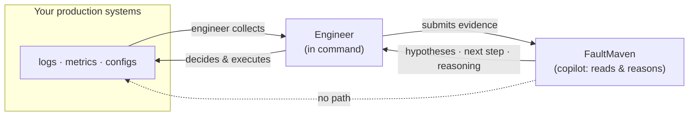

The pitch is seductive, and you've heard it: an AI wired into your production
environment that detects the incident, forms a diagnosis, and *fixes it* —
rolling back the deployment, restarting the pod, scaling the node group, all at
machine speed, before you've finished reading the page. "Autonomous
remediation." The outage heals itself while you sleep.

If you've been on-call for more than a couple of years, your reaction to that
pitch is not excitement. It's a specific, cold question: *what happens when it's
wrong?*

## The failure mode nobody demos

An autonomous remediation system is only as good as the conclusion it acts on.
And conclusions during an incident are frequently wrong — not because the model
is bad, but because the early minutes of an outage are the moment you have the
least evidence and the most noise. Correlated symptoms point at three different
subsystems. The real cause is two hops upstream of where the alert fired. The
"obvious" fix addresses a symptom and masks the actual fault for another hour.

Now give that reasoning process your production credentials and the standing
authority to act. Three things get worse at once:

- **Blast radius.** A human running `kubectl rollout undo` on the wrong
  deployment fixes one mistake and stops. An automated actor applies the wrong
  fix across every matching resource, at once, and then — because the symptom
  changed but didn't clear — reaches for the *next* action. Machine speed is a
  benefit when the decision is right and a catastrophe when it isn't. The
  automation doesn't hesitate, and hesitation is often what saves you.
- **Un-auditability.** When the fix comes from a human, there is a person who
  can tell you *why* at 3 a.m. When it comes from an autonomous agent, the
  post-incident review starts with archaeology: reconstructing what the system
  concluded, from what inputs, and why it chose to act. You inherit the actions
  without inheriting the reasoning.
- **Acting on a wrong conclusion is the whole risk.** Every other concern is
  downstream of this one. A read-only wrong conclusion costs you a few minutes.
  A write-capable wrong conclusion costs you an incident inside your incident.

There's a deeper, better-documented reason to be wary, and it predates LLMs by
forty years.

## The ironies of automation

In 1983, Lisanne Bainbridge published a short paper called "Ironies of
Automation." Its argument has aged unreasonably well. When you automate the
routine parts of a control task, two ironies follow.

First, you leave the human with exactly the parts that *couldn't* be automated —
the novel, ambiguous, high-stakes exceptions — while giving them less and less
practice at the routine work that built their intuition for the system. The
operator is asked to take over precisely when things have gone strange, which is
the hardest possible moment, using skills that automation has quietly eroded.

Second, an operator monitoring an automated system that works well *almost
always* becomes a poor monitor of it. Vigilance decays. Trust calibrates upward.
When the automation finally acts on a bad premise, the human who was nominally
"in the loop" is the least prepared they've ever been to catch it. The industry
now calls this automation complacency, and the SRE literature echoes the same
caution: automation applied to a flawed decision doesn't fix the decision, it
executes it faster and at greater scale.

The lesson isn't "don't automate." It's that automation changes *what the human
is good at*, and if you automate the reasoning during an incident, you are
training your on-call engineers to not understand their own systems. That bill
comes due during the outage the automation can't handle — which is the only kind
of outage that ever really hurts you.

## The division of labor we chose

We build FaultMaven, an AI-powered troubleshooting copilot. When we designed how
it participates in an investigation, the ironies-of-automation problem was the
constraint we designed *around*, not a footnote. We drew one hard line: the
engineer stays in command of every action, and the copilot never touches
production.

Concretely, we split the work the way a senior engineer and a sharp pair-partner
split it at a whiteboard:

- **The engineer** gathers evidence and runs commands. They pull the logs, query
  the metrics, run `kubectl describe`, and — critically — they are the only one
  who ever executes anything against a live system.
- **The copilot** analyzes what it's given. It reads the evidence you bring,
  proposes hypotheses, ranks them by what the data actually supports, tells you
  the single most decisive next diagnostic step, and shows its reasoning so you
  can disagree with it.

Evidence flows *in* to the copilot. Actions flow *out* through the human. Those
are two different directions, and the boundary between them is where safety
lives.

There is no arrow from the copilot to your production systems. Not a locked one,
not a permissioned one — no arrow at all.

## "Never holds production credentials" is the architecture

This is the part that gets misread as a limitation, so it's worth being precise:
FaultMaven does not connect to your production systems and does not hold
production credentials. That is not a feature we haven't shipped yet. It's the
design.

Two things enforce it.

**The tools are read-only, over evidence you hand it.** The copilot's tools
search the files you've submitted, run interpreted analysis over sections of
them, query your knowledge base of runbooks and past fixes, and — when you allow
it — search public technical documentation. None of them reach into a live
environment. There is no "restart the service" tool, no "scale the deployment"
tool, no credential store for it to draw on. The agent has zero standing
authority to change the state of anything, because the capability to do so was
never built into it.

**The copilot speaks as an advisor, and we enforce that in its voice.** A model
that *sounds* like it's taking action ("Let me restart the pod and check…")
trains you to believe it can — and that false expectation is its own hazard. So
we constrain the language. The copilot doesn't say "I'll run that" or "let me
check the database." It says "could you run this," "it would help to look at
that." The grammar is prescriptive: it is a thing that recommends, not a thing
that executes, and it isn't allowed to blur the line even rhetorically.

When the copilot does recommend an action you might take, it classifies it
first. A read-only diagnostic (`logs`, `describe`, `get`, `SELECT`) it simply
suggests. A state-modifying action (`restart`, `delete`, `scale`, `DROP`, a
config change) comes with three things attached: what the action changes,
whether it's reversible, and the blast radius — single pod, node, cluster,
shared database. An advisor who tells you to `kill -9` a stateful pod without
mentioning it may corrupt the write-ahead log isn't an advisor; it's a liability
with better manners. The impact annotation is part of the recommendation, not an
optional extra.

The workflow that ties it together is deliberately human-gated. The copilot
**recommends** a specific step and shows the evidence and reasoning behind it.
You **verify** — you're the one who decides whether the reasoning holds against
what you know that isn't in the logs. Then *you* **act**: you run the command, in
your terminal, with your credentials, and you bring the output back. The
investigation advances because you executed something and reported what
happened, not because an agent reached into your cluster. The human isn't a
rubber stamp in this loop. The human is the actuator.

## Being honest about the trade-off

This is slower than autonomous remediation. We're not going to pretend
otherwise, because you'd catch us immediately.

If a deployment rollback would fix your outage, a system with your credentials
and a green light *could* do it in the time it takes you to read the
recommendation. Ours won't. It will hand you the rollback command, tell you what
it changes and that it's reversible, explain which evidence points at the last
deploy, and wait for you to run it. On the incidents where the diagnosis is easy
and correct, that's pure added latency, and we own that cost.

We took the trade deliberately, because the incidents where the diagnosis is
easy and correct are not the incidents that hurt you. The ones that hurt are the
ambiguous, multi-cause, evidence-is-lying-to-you incidents — and those are
exactly the ones where machine-speed action on a premature conclusion turns one
outage into two. We optimized for not making your worst night worse, at the cost
of a little friction on your routine ones. For a troubleshooting tool, that's the
right side of the trade.

There's a compounding benefit that only shows up over months. Because you stay in
command — you run every command, you make every call — you keep learning your own
system. You don't deskill. The copilot pushes *back* against the first irony of
automation instead of accelerating it: it does the tireless work of correlating
evidence, checking runbooks, and holding a dozen half-formed hypotheses in
working memory, while leaving the judgment and the hands where they belong. Six
months in, your on-call engineers understand production *better*, not worse,
because they were never automated out of the loop that builds that understanding.

## The takeaway you can use without us

You don't need our product to apply the principle. When you evaluate any AI that
promises to help during incidents, ask one question: *does it act, or does it
advise?* Then check whether that answer is enforced by architecture or by
policy.

An AI that holds production credentials "but is configured not to use them
without approval" is one config change, one prompt-injection, one
over-eager-defaults release away from acting. An AI that was never built with a
path to your production systems cannot cross a line it has no legs to walk to.
"Read-only by permission" and "read-only by construction" are not the same
guarantee, and during your worst outage, only the second one holds. Push the
tools you adopt toward the second kind. Keep the credentials, and the command, on
the human side of the boundary.

FaultMaven is source-available and the Standalone deployment is free to
self-host — so your evidence can stay on your own infrastructure while you try
the copilot pattern for yourself. The
[Quick Start](https://github.com/FaultMaven/faultmaven#quick-start) takes a few
minutes, or come see what we're building at
[faultmaven.ai](https://faultmaven.ai).
