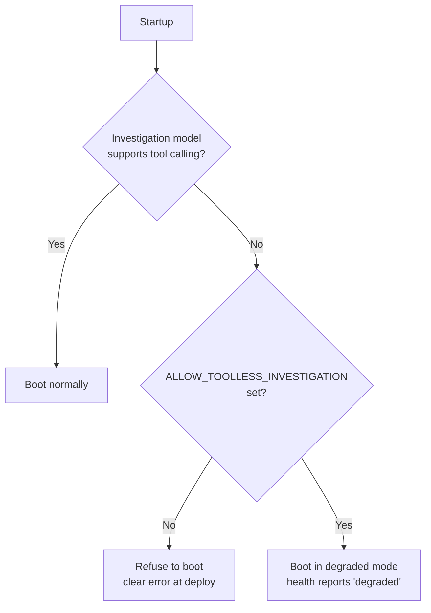

Your LLM-backed feature works. You built it against GPT-4o or Claude, the outputs are clean, the state moves the way it should. Then someone points it at a cheaper model — or a self-hosted one for the air-gapped environment, or an open-weight model to cut the bill — and it keeps working. No exceptions. No stack traces. The requests return `200`, the JSON parses, the app renders.

Except the answers are a little thinner. A field that used to be populated is sometimes empty. A multi-step flow that used to gather three pieces of context now gathers zero and answers anyway. Nothing logs an error, because from the code's point of view nothing went wrong. You only notice weeks later, when someone asks why the output quality quietly fell off a cliff.

This is the failure mode nobody warns you about when they say "it's all OpenAI-compatible, just swap the model." The API surface is portable. The capabilities behind it are not.

## The compatible API is a shape, not a contract

"OpenAI-compatible" means a provider accepts the same request body and returns the same response envelope: a `messages` array in, a `choices[].message.content` out, `response_format` and `tools` fields available on the way in. Most hosted providers and every local runtime worth using speak this dialect now. That's genuinely useful — you write one client and talk to nine backends.

But the fields being *present* in the schema says nothing about whether the model behind them *honors* them. `response_format: {type: "json_schema"}` is a request. Whether the model is actually constrained to that schema, or merely encouraged toward it, depends entirely on the provider and the specific model. The wire format is identical in both cases. The guarantee is not.

So "swap the model" is really "swap the guarantees, silently, while the code that depended on them keeps compiling." For a chat toy that's fine. For any system that drives state from model output, it's a latent outage.

## Two very different meanings of "supports structured output"

Ask a provider whether it supports structured output and you'll almost always get a yes. That yes covers at least two things that behave nothing alike.

**Enforced (strict).** The model is constrained during decoding to emit only tokens that keep the output valid against your schema. OpenAI's `json_schema` with `strict: true`, Anthropic's forced tool use, Gemini's schema-constrained generation. Required fields are present because the decoder physically cannot end the object without them. If the model has nothing good to put in a field, you get a bad value — but you get the field, and your parser and your types hold.

**Best-effort.** The model is handed the schema in the prompt and asked, in effect, to please match it. Groq on Llama, most open-weight models on a local runtime, several hosted open-model gateways, and Cohere's JSON mode all live here. On a good day the output is perfect. On a bad day the model renames a field, nests something one level too deep, or — the one that hurts — omits a required field entirely because it didn't have much to say there.

Here's the trap. A best-effort miss is **not an exception**. The response is valid JSON. It parses. If you decode into a permissive type, the missing field just becomes a default or a `None`, and the value silently vanishes. Consider a response that carries a state update:

```json
{
  "answer": "The database connection pool is exhausted.",
  "state_updates": {
    "hypothesis": "connection pool exhaustion under peak load",
    "confidence": 0.7,
    "evidence_refs": ["log-4412", "metric-cpu-9"]
  }
}
```

Under a strict model, `state_updates` is always there and always shaped correctly, so the system that consumes it advances. Under a best-effort model, the same prompt can come back as just:

```json
{ "answer": "The database connection pool is exhausted." }
```

The prose is fine. The reader is satisfied. And the machinery that was supposed to record the hypothesis, attach the evidence, and move the investigation forward gets nothing, drops the update, and stays exactly where it was. Turn after turn. The user sees plausible text and assumes progress is being made; the system's actual state is frozen. Nothing in the logs says "the model didn't fill in the field it was told was required," because at the protocol level, it didn't do anything wrong.

The lesson generalizes past LLMs: **when a required output is enforced by convention rather than by the transport, the failure is silent by construction.** You don't find out from an error. You find out from a metric that drifts, or a user who complains.

## Tool calling is the harder cliff

Structured output degrades quality. Missing tool calling changes the *kind of system you have* — and it degrades even more quietly.

A system that must gather evidence before it concludes depends on the model being able to call functions: fetch a log slice, query past incidents, read a config, search a file. That loop is the difference between an answer grounded in your data and an answer generated from the model's priors. Take a model that can't call tools and drop it into that loop, and it does not error out. It can't reach the tools, so it does the only thing it can: it answers immediately, from whatever was already in the prompt, with total fluency and total confidence.

That's the worst possible failure for a troubleshooting system, because *concluding without investigating* is exactly the behavior you built the tool loop to prevent. The model skips straight to a guess and dresses it as a diagnosis. And unlike a strict-vs-best-effort schema miss, which at least leaves a malformed artifact, a skipped investigation leaves no trace at all. The transcript looks like a confident, complete answer. It just isn't grounded in anything.

Provider support here is genuinely uneven, and not along the lines you'd guess from brand reputation. Some strong open-weight models can't do OpenAI-style tool calling at all over the transport their runtime exposes — a local model served through a plain generation endpoint physically can't return a `tool_calls` array, regardless of how capable the weights are. Some hosted models accept a `tools` parameter and then either ignore it or use a proprietary token format the compatible API can't parse, so forcing a tool call returns a `400` or times out. "Can this model call tools" is a property of the model *and* the way it's being served, and the only honest answer is to check, per model, not per vendor.

## We support nine providers, so we had to stop trusting the brand

FaultMaven is an AI-powered troubleshooting copilot: it correlates the logs, metrics, and configs you share with runbooks, documentation, and past fixes to work an incident the way a seasoned engineer would — methodically, from evidence, not from a guess. It's source-available and self-hostable, and it runs against nine LLM providers: Anthropic, OpenAI, Gemini, Fireworks, Groq, HuggingFace, Cohere, OpenRouter, and local Ollama or vLLM.

We didn't support nine providers to pad a feature list. We support them because the people running FaultMaven have real constraints. An air-gapped environment can only use a local model. A cost-sensitive team wants the cheap fast provider for the bulk of the work. A regulated shop has one approved vendor. Choice isn't a nicety here; it's the deployment reality.

And the moment you take choice seriously, you collide with everything above. We could not assume the configured model enforced schemas. We could not assume it could call tools. We could not even assume that two models *from the same provider* had the same capabilities — they routinely don't. Routing by brand — "if Anthropic do X, if OpenAI do Y" — is a pile of special cases that's wrong the day a provider ships a new model. So we stopped routing by brand and started routing by capability.

## Classify the model, then route the job to a model that can do it

Every provider we support answers two questions about any given model, at runtime, not from a hardcoded vendor table:

- **What's its structured-output guarantee?** One of `STRICT` (schema enforced by the decoder), `FUNCTION_CALLING` (enforced via forced tool use), `BEST_EFFORT` (asked in the prompt, not enforced), or `NONE` (parse it out of prose).
- **Can it call tools?** Yes or no, for *this* model on *this* transport — including the denylist of models that accept a `tools` parameter but choke when you actually force a call.

Those two answers, not the provider's name, decide how a request is built and where each job is sent. The insight that made this tractable is that **not every job needs the same guarantee.** Classifying a query into a category, or synthesizing a fluent summary from already-structured data, tolerates a best-effort model just fine — and those jobs are frequent and want a cheap, fast model. Driving state from a large schema-constrained response does *not* tolerate best-effort, and neither does the evidence-gathering loop. So you match the model to the job:

```bash
# The state-carrying reasoning path needs enforced schemas AND tool calling.
CHAT_PROVIDER=openai          # STRICT structured output, reliable tool use

# Cheap, high-volume jobs that only need "roughly right" JSON — send them
# to a fast, inexpensive model on purpose.
CLASSIFIER_PROVIDER=groq      # query routing / classification
SYNTHESIS_PROVIDER=fireworks  # fast summary generation from structured input
```

The primary reasoning role gets a model that enforces schemas and calls tools. The high-volume, low-stakes roles get a fast cheap model whose best-effort JSON is completely adequate for the task. You spend the expensive, strict capability only where losing it would break the system, and nowhere else. That's not a portability workaround — it's just correct engineering once you accept that capability is the unit that matters.

## Fail fast at startup, not silently in production

Routing by capability solves the "which model for which job" question. It doesn't stop someone from configuring the primary reasoning role with a model that can't do the job at all. The whole point of this post is that such a misconfiguration is invisible at runtime, so the defense has to move earlier: to boot time.

FaultMaven runs a capability gate at startup. It resolves the model that will drive the investigation, asks whether that model can call tools, and if it can't, **refuses to start** — the same way it refuses to start on a missing credential or an incoherent deployment config. You find out at deploy, from a clear failure, not three weeks later from a quality regression.



There's an escape hatch — an explicit opt-in that lets you run a tool-incapable model on purpose, for a genuinely offline or degraded deployment. But it's a knowing choice you have to make by name, and when you make it, the health endpoint reports `degraded` for as long as it's in effect. The default is: the system will not pretend to investigate with a model that can't.

That leaves *transient* failures — a strict, tool-capable provider that happens to rate-limit you, or drops a single tool call on an otherwise fine turn. Those aren't capability problems and shouldn't take the system down, so they're handled separately: a fallback chain moves the request to the next provider when one is failing, and a per-turn retry covers a one-off tool hiccup on a model that's normally capable. Capability gaps fail fast and loud at startup; transient faults degrade gracefully at runtime. Keeping those two mechanisms distinct matters — conflating them is how you end up either crashing on a blip or silently limping on a fundamentally wrong model.

## The takeaway

"Portable across LLM providers" is true at the layer nobody's system actually depends on — the request shape — and false at the layer everybody depends on: what the model is guaranteed to do. If your feature relies on structured output or tool calling, the unit of portability is not the vendor and not even the model name. It's the specific capability, checked for the specific model and the specific way it's being served.

So, concretely, for your own systems: write down which capability each part of your pipeline actually requires — enforced schema, tool calling, or neither. Detect that capability at the model level rather than assuming it from the provider. Route each job to a model that has what the job needs, and spend your expensive strict-and-tool-capable model only where losing it would break something. And put a check at startup that refuses to run — or at minimum flags itself as degraded — when the configured model can't meet the requirement, because the one thing you can count on is that it won't tell you at runtime. Silent degradation is only silent until you decide to make it loud.

FaultMaven is source-available and the Standalone deployment is free to self-host, capability gate and all — the [Quick Start](https://github.com/FaultMaven/faultmaven#quick-start) takes a few minutes, or see what we're building at [faultmaven.ai](https://faultmaven.ai).
