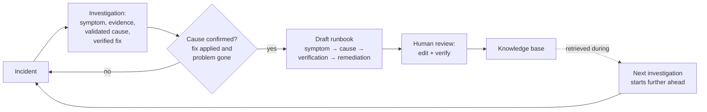

The pager goes off a little after midnight. `FATAL: too many connections for role`. Latency is climbing, the pool is saturated, and you're staring at `pg_stat_activity` trying to remember whether you're supposed to kill the idle-in-transaction sessions or bump `max_pool_size` — and which one makes it worse.

Somewhere, this exact failure was solved eight months ago. A teammate spent two hours on it, found the misconfigured retry policy holding connections open, wrote a genuinely good postmortem, and closed the ticket. That knowledge now lives in one of three places: a closed ticket nobody searches, a wiki page that's three schema versions out of date, or the head of an engineer who left in Q3.

So you solve it again. The organization pays for the same investigation twice — and it will pay a third time, because nothing about tonight is going to land anywhere the next on-call engineer will find it either.

This is the most expensive recurring cost in operations that nobody puts on a dashboard: **resolution knowledge evaporates faster than it accumulates.** We want to talk about why the usual fixes don't work, and about the one structural change that does.

## Why postmortems and wikis don't close the gap

The standard answer to "we keep re-solving things" is *write it down*. Write a postmortem. Update the runbook. Keep the wiki current. Every reliability program says this, and every reliability program watches it fail the same way.

It fails because writing knowledge down is structured as a **separate step that happens after the work is over**. The incident is resolved. The adrenaline is gone. The service is green. And now — as a distinct chore, with its own activation energy — someone is supposed to reconstruct what just happened into a durable document. That's homework, assigned at the moment everyone most wants to stop thinking about the problem.

The predictable results:

- **Postmortems get written and never re-read.** They're narratives, optimized for the retro meeting, not for retrieval eight months later when a different symptom points at the same cause. Nobody greps a postmortem at 2 a.m.
- **Wikis rot** because keeping them current is, again, a separate chore detached from the work. A runbook is only trustworthy if it's maintained, and maintenance loses every time to actual incidents.
- **The knowledge that matters most is the least likely to be captured** — the system-specific failure mode ("our payment service fails silently when Redis is down because of a retry policy") that no vendor doc will ever contain. That lives in exactly one person's memory.

The core mistake is treating knowledge capture as an *authoring* problem. It isn't. By the time you resolved the incident, you already produced the knowledge. The symptom, the diagnostic steps you ran, the evidence they returned, the cause you validated, the fix that worked — all of it already exists as a record of what you just did. The gap isn't that the knowledge wasn't created. It's that it was never *structured for retrieval* and left to decay in prose.

## Capture from the investigation, not after it

The change that works is to stop asking anyone to do homework. Capture the knowledge from the investigation itself, while all the material is still on the table.

An investigation that reached a real resolution already contains everything a runbook needs:

- The **symptom** that opened it — the alert, the error string, the metric pattern.
- The **diagnostic steps** the engineer ran, and the **evidence** those steps returned.
- The **validated cause** — not a guess, the one that survived the investigation.
- The **verified fix** — the remediation that was actually applied and actually worked.

That's a runbook. It's just not shaped like one yet. This is the approach we took with FaultMaven: when a case reaches resolution, the investigation record is already the raw material, so the system offers to turn that case into a draft runbook — no separate authoring session, no blank page.

The word *draft* is load-bearing, and we'll come back to it. First, the shape.

## Prose doesn't retrieve. Structure does.

A postmortem is a story: first we saw X, then we suspected Y, then Sarah noticed Z. Stories are how humans understand incidents and exactly the wrong format for a machine — or a stressed engineer — to retrieve under pressure. When the symptom recurs, you don't want a narrative. You want the four things that map to what's in front of you: *does this symptom match, how do I confirm the cause, what's the fix, and how do I verify the fix worked.*

So the conversion doesn't produce prose. It produces a structured runbook, one failure mode per document, in a fixed shape:

```markdown
## Symptom Recognition
- "FATAL: too many connections for role"
- pg_stat_activity active connections > pool size for >5 min

## Diagnostic Steps
### Step 1: Check active connections by state
### Step 2: Find idle-in-transaction sessions older than 30 min

## Causes
### Cause A: Idle transactions holding connection slots
  Statement: sessions stuck 'idle in transaction' never release their
             slot, so max_connections is reached under steady churn.
  Remediation: bound idle_in_transaction_session_timeout to reclaim slots.
  Verification: re-run Step 2 — old idle sessions no longer accumulate.
```

Two design decisions matter here, and both are about retrieval rather than readability.

**One runbook equals one failure mode.** "Everything about PostgreSQL" is useless: only a buried paragraph matches any given symptom, and the whole sprawling document competes in search against tightly-scoped ones. Atomic runbooks win retrieval because the entire document is relevant to the query. FaultMaven splits multi-topic source material into separate runbooks rather than one mega-document.

**The cause carries its own verification.** Every documented cause pairs a fix with the specific check that confirms the fix worked — re-run Step 2, watch the idle sessions stop accumulating. A remediation without a verification is a suggestion; a remediation with one is a procedure. When the system later retrieves this cause during a live investigation, the verification is what lets it — and you — confirm you fixed the right thing rather than masking it.

Structuring around the symptom is what makes the knowledge *findable* by the next person, whose incident won't describe itself the way tonight's did. Same cause, different-looking symptom, and the structured runbook still surfaces because the symptom section was written to be matched, not read.

## A wrong runbook is worse than no runbook

Here is the part we're most opinionated about, and the part that separates a knowledge flywheel from a knowledge landfill.

**Nothing generated from a case enters the shared knowledge base automatically.** The conversion produces a *draft*. A human reviews it, edits it, and explicitly verifies it before it becomes searchable. Until then it sits outside retrieval entirely — invisible to the next investigation.

This is not caution for its own sake. A knowledge base is a force multiplier in both directions. A good runbook makes every future investigation that retrieves it faster. A *confidently wrong* runbook silently degrades every future investigation that retrieves it — and it does so with the authority of "this is documented," which is far more damaging than a blank where knowledge should be. Bad knowledge doesn't just fail to help; it actively misleads, and it does it quietly. So the gate is deliberately at the point of entry, where a human is cheap, rather than after the fact, where debugging a bad automated answer is expensive.

We put a second constraint in front of the human gate, upstream of it. FaultMaven only *offers* to make a runbook from a case when the cause clears a specific bar: the fix was actually applied, and when it was applied, the problem actually went away. A cause that's merely plausible — a good-looking theory nobody counterfactually confirmed — doesn't get offered for conversion at all. The reasoning is the same guarantee scaled up: a single investigation that reaches a shaky conclusion costs one team one bad night; a shaky conclusion promoted into reusable knowledge costs every future investigation that retrieves it. Reusable knowledge has to clear a higher bar than a one-off answer, so the material that becomes a runbook is held to "we confirmed this," not "we suspected this."

The result is a pipeline with two filters — an evidence bar the case must clear to be offered, and a human who reviews before anything is published — and only what passes both becomes knowledge the system will act on.

## The compounding part

Capture-and-structure alone would already beat the status quo. But the reason it's a *flywheel* and not just a filing system is what happens on the next investigation.



Once a runbook is verified, it doesn't just sit in a wiki waiting to be searched by a human who remembers it exists. It re-enters the investigation itself. When a new case shows a matching symptom, FaultMaven retrieves the relevant runbook as context — the documented causes become *structured candidates* the investigation starts from, rather than blank hypotheses it has to derive from scratch.

The critical discipline: a retrieved cause enters the new investigation as a **prior, not a verdict**. It's a candidate the system still has to confirm against *this* case's evidence — never treated as validated just because it worked last time. If tonight's evidence refutes it, it gets demoted like any other failed hypothesis. That's the difference between a system that learns and a system that pattern-matches its way into confidently repeating last month's mistake. The knowledge makes the next investigation start further ahead; it never lets it skip the evidence.

That's what "never forgets what it learns" means concretely. Each resolved incident that clears the bar leaves the knowledge base a little denser, and the next investigation into anything nearby starts from a confirmed cause instead of a cold start. The system compounds toward your infrastructure's *actual* failure modes — the misconfigured retry policy, the specific WAL-disk pattern your storage tier produces — not the generic ones a base model can already guess at.

## Be honest: the flywheel has to spin up

None of this pays off on day one, and we'd be selling something false if we implied otherwise.

A flywheel is heavy at the start. The first resolved case seeds one runbook. That runbook helps only if a matching symptom recurs, and only if it cleared the bar to be captured at all. Early on, most of your incidents won't match anything, because there's nothing there yet. The value is in the compounding, and compounding takes turns to become visible — the tenth month looks nothing like the first.

There are honest limits on the mechanism today, too. The strongest form of the loop — where a resolved case's confirmed cause becomes a structured candidate that seeds the *next* investigation — currently keeps that knowledge scoped to the engineer who owned the case: your resolved incidents sharpen your own future investigations. Sharing captured knowledge across a whole team, so one engineer's 2 a.m. save becomes the whole rotation's head start, is the natural next turn of the flywheel and where a lot of the compounding value lives. It's the part we're actively building, not the part we're claiming is finished.

And the gate is real friction on purpose. Someone still has to review each draft before it's trusted. We think that's the right trade — a smaller base of knowledge you can trust beats a large one you can't — but it's friction, and pretending otherwise would just be the wiki-rot problem wearing a new coat.

## The takeaway you can use tonight

You don't need our product to apply the underlying idea, and it's worth applying regardless: **stop treating knowledge capture as authoring, and start treating it as a byproduct of resolution.** The next time your team closes an incident, don't ask "who's writing the postmortem." Ask "what's the smallest structured artifact — symptom, cause, verification, fix — that would let the next person recognize this in thirty seconds," and capture *that*, while the evidence is still open in front of you. Then put a real gate in front of it: nothing becomes trusted troubleshooting knowledge until a human confirms the cause was actually validated and the fix actually worked. A knowledge base you can trust compounds; one you can't quietly decays into noise.

FaultMaven is our attempt to make that byproduct automatic — to turn each resolved investigation into a structured, reviewed, retrievable runbook instead of a story nobody re-reads. It's source-available, and the Standalone deployment is free to self-host if you want to see the flywheel turn on your own incidents: the [Quick Start](https://github.com/FaultMaven/faultmaven#quick-start) takes a few minutes, or you can follow what we're building at [faultmaven.ai](https://faultmaven.ai).
