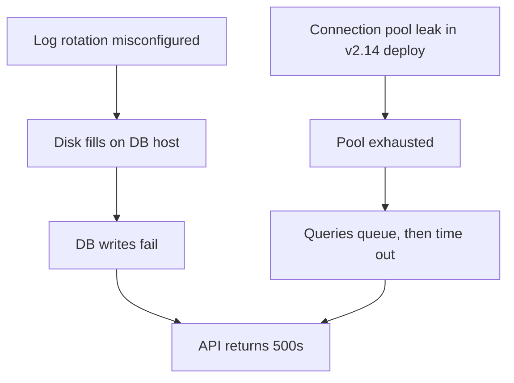

Three hours into the outage, the whole call is working one theory. Someone floated it in the first twenty minutes — it was plausible, it fit the first graph anyone looked at, and it gave everyone something to do. Since then, every piece of evidence that fits the theory gets posted to the channel. Every piece that doesn't gets explained away: "that metric's always noisy," "that's probably unrelated." Around hour two, someone shipped the fix the theory implied. The problem didn't go away. And here's the part worth sitting with: **the theory survived its own failed fix.** The team concluded the fix was applied wrong, or needs time to propagate, or missed an edge case — anything but the obvious reading, which is that the theory is wrong.

If you've been on call for more than a year, you've been on that call. Probably on both sides of it.

## The bias has a name — several, actually

None of this is a character flaw. It's how human reasoning works under pressure, and it's been documented for decades. Tversky and Kahneman's 1974 *Science* paper on judgment under uncertainty described **anchoring**: initial estimates pull all subsequent reasoning toward themselves, even when the anchor is arbitrary. Wason's experiments in the 1960s showed **confirmation bias** in its purest form — given a rule to discover, people overwhelmingly propose tests their current hypothesis predicts will *pass*, almost never tests that could prove it wrong. Human-factors researchers studying operating rooms and cockpits call the incident-time version a **fixation error**: the operator locks onto one diagnosis and stops processing evidence against it, precisely when the stakes are highest.

An incident bridge is a near-perfect incubator for all three. Time pressure rewards the first plausible story. Social dynamics reward the person who called it early. And a theory that gives everyone a task *feels* like progress, which makes abandoning it feel like losing ground.

You don't fix a bias by telling people to be less biased. You fix it with structure — with a method that produces the right behavior even when every individual instinct is pulling the other way. Here's what that structure looks like for troubleshooting.

## A hypothesis is a chain, not a label

Start with what a hypothesis even is. "Disk full" is not a hypothesis. It's a label — and labels are where anchoring hides, because a label is vague enough to absorb almost any evidence.

A hypothesis worth testing is a **causal chain** from a root cause all the way to the symptom you're staring at:

> Log rotation misconfigured → disk fills on the DB host → DB writes fail → API returns 500s

Every link in that chain is a claim you can check. Is log rotation actually misconfigured? Is the disk actually filling, at a rate consistent with the log volume? Are the DB errors actually write failures — and do they say `no space left on device`, or something else entirely? A chain gives you four places to falsify the theory. A label gives you zero, which is exactly why labels feel so safe on a bridge call.

The chain structure also exposes a distinction the label hides: an **intermediate state** is not a root cause. "The disk is full" might be true and still not be your answer — *why* is it full? A restated symptom ("the API is erroring because requests are failing") is not a hypothesis at all; it's the problem wearing a costume.

## One favorite is not an investigation

The second discipline: hold **competing chains** simultaneously. Distinct candidate causes, each a full chain down to the same symptom:

Two chains, one symptom. And now something useful happens that never happens with a single favorite: **the chains disagree about the world**, and you can test the disagreement. The disk chain predicts write errors with a filesystem signature. The pool chain predicts timeouts and queue depth, with onset correlated to the deploy. One cheap query against the error logs discriminates between them — the information lives where the chains diverge, not where they converge. (Everything converges at the symptom; testing there teaches you nothing.)

This is also the tell for a theory that shouldn't be on the board at all: **if no evidence you can actually gather could distinguish a hypothesis from its rivals, it isn't a hypothesis — it's a mood.** Every chain on the board should come with an answer to "what observation would kill this?" If a link can be neither confirmed nor refuted — the data rotated away, the system can't be probed — mark it inconclusive and deprioritize the chain. What you must never do is fabricate a verdict on a link nobody can observe.

## A failed fix is evidence — the strongest kind

Now the moment from the opening. The fix implied by the theory shipped, and the problem is still happening. What does disciplined reasoning do here?

It treats the failed fix as **counterfactual disconfirmation** — close to the strongest evidence an investigation ever produces. You removed the supposed cause and the effect persisted. In any formal treatment of causal reasoning, that demotes the hypothesis, immediately. The theory goes back on the board as one candidate among several, with the failed fix attached to it as refuting evidence, and the investigation resumes across the alternatives.

There's one legitimate exception, and it's worth naming precisely because it's also the favorite escape hatch: an *implementation* error — right theory, botched rollout. That's a real possibility, and it's checkable. But "the fix needs more time" and "there must be a second instance of the same cause" are, most of the time, the sound of a team protecting its anchor.

Humans are reliably bad at this exact move. Demoting the theory means the last two hours were spent on the wrong branch, and nobody wants to be the one who says so. This is the point where we stopped trusting discipline and started building structure — it's one of the founding design decisions in **FaultMaven**, the AI-powered troubleshooting copilot we're building. Its investigation engine represents every hypothesis as a causal chain in exactly the sense above, and when a fix is applied and the symptom persists, the engine demotes the chain **deterministically** — in code, not as a suggestion the AI model may or may not act on. The refuting evidence is attached, the confidence recomputes, and no conclusion survives its own disproof. The reasoning about *which* alternative to pursue next stays with the model and the engineer; the demotion itself is not up for negotiation. The structure is firm so the reasoning stays honest.

## Confidence should decay

Anchors don't only survive refutation — they survive *neglect*. A theory that hasn't produced a confirmed prediction in ten turns of investigation still sits at the top of everyone's mind, purely because it got there first.

So the fourth discipline: **confidence decays without progress.** In FaultMaven's engine, a hypothesis that keeps getting worked without advancing — evidence analyzed, tests returned, and still no link confirmed — loses confidence turn over turn, and the engine watches for anchoring explicitly: a weak theory absorbing a disproportionate share of the investigation gets flagged rather than indulged. A stale favorite loses its grip mechanically, the way it never does socially.

One subtlety that's easy to get wrong: decay has to count *investigation* turns, not wall-clock turns. If the engineer spends three turns capturing a network trace that the leading hypothesis asked for, that's not stagnation — that's the test in flight. Penalizing a chain for the latency of its own experiment would punish exactly the behavior you want. Decay applies when a hypothesis had the opportunity to advance and didn't.

## Two grades of "we found it"

The chain structure buys one more distinction that flat theories can't express. There are two very different confidence grades hiding inside "we found the root cause":

1. **Mechanistically validated** — you've *observed* the cause and its mechanism, link by link, before touching anything. This is the bar for proposing a fix. In FaultMaven's engine it's a hard gate: a remediation cannot even be registered against a cause that hasn't cleared it. Before that point there are only *tests* — actions that produce evidence — never solutions.
2. **Counterfactually confirmed** — you removed the cause and the symptom disappeared. *Gone implies gone.* This, and only this, is the bar for calling the case resolved.

The window between the two grades is exactly where fixes fail — and treating them as one grade is how a team ends up declaring victory on a mechanism they never actually confirmed. Validation itself is empirical only: a chain link is confirmed by a direct observable fact — a log line, a return code, a reproduction — never by assertion, plausibility, or "it correlates."

## "We don't know yet" is a finding

The last discipline is the one that feels worst in the moment: **refusing to conclude when the evidence doesn't support a conclusion.** Some causes leave no footprint — a race, a transient network blip, data that rotated away before anyone looked. An investigation that has genuinely exhausted its obtainable evidence has two honest outputs: what was ruled out, and what specific data would decide what remains. That is a valid outcome. A confident wrong answer is not — it's worse than nothing, because it ends the search and enters the postmortem as fact.

FaultMaven's engine treats this as a first-class state rather than an embarrassing one. When real diagnostic work has happened and no cause can be grounded in the available data, the engine drives a structured handoff — here's what's established, here's what remains uncertain, here's the evidence that would discriminate — instead of letting the model improvise a conclusion. And it never closes the case on its own; the engineer owns that decision, always.

We'll be honest about what this discipline costs, because it isn't free. A strict evidence bar means the engine sometimes *withholds* certification of a cause the team genuinely fixed — the case still resolves on the confirmed fix, but the cause isn't promoted into the knowledge base as a validated runbook, because the evidence trail didn't clear the bar. That's a real recall cost, and we accept it deliberately: an under-certified true answer is recoverable; a certified wrong answer poisons every future investigation that retrieves it. When your knowledge base feeds the next incident, the certification bar *is* the product.

## What you can take to your next incident

None of this requires our software. On your next bridge call:

- **Ban labels.** Make whoever proposes a theory state the full chain to the symptom. "Disk full" doesn't get written on the board; "log rotation → disk → write failures → 500s" does.
- **Require a rival.** No single-hypothesis investigations. If there's only one theory, the next task is generating a second, not testing the first.
- **Ask the kill question.** For every chain: what observation would refute this? If nobody can answer, it comes off the board.
- **Pre-commit to the demotion.** *Before* shipping a fix, say out loud: "if this doesn't clear the symptom, the theory is demoted." It's much harder to rationalize afterward if you said it beforehand.
- **Let staleness count.** If a theory hasn't confirmed a prediction in an hour, its seniority on the whiteboard is not evidence.

The uncomfortable truth about incident investigation is that your first theory is usually wrong — and that's fine, because investigations aren't won by guessing right early. They're won by killing wrong theories fast and refusing to fall in love with the survivors.

If you'd rather have a copilot that holds this discipline for you at 3 a.m., FaultMaven is source-available and the Standalone deployment is free to self-host — the [Quick Start](https://github.com/FaultMaven/faultmaven#quick-start) takes a few minutes, or see what we're building at [faultmaven.ai](https://faultmaven.ai).
