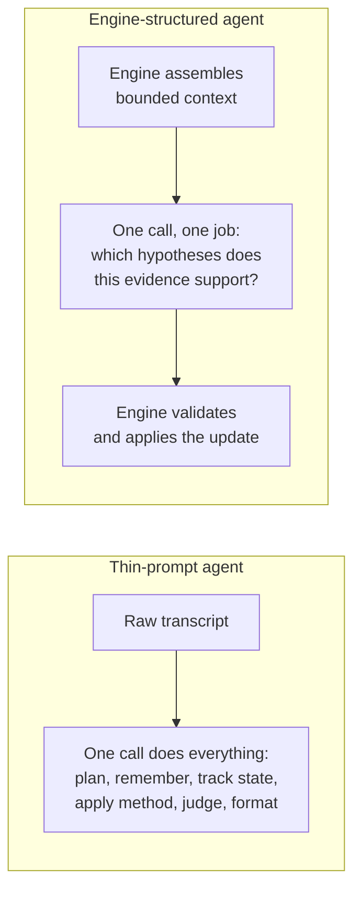

You've seen this demo, maybe given it. An agent, built in a sprint or two, wired to the best model money can buy. It plans, it remembers, it reasons through a multi-step problem, and it lands the right answer with something that looks like judgment. The room is impressed. Then reality intrudes — a self-hosting customer with no frontier API access, a finance review that wants the token bill cut in half, a rate limit that makes the flagship model impractical at volume — and someone swaps in a cheaper, smaller model to see what happens.

What happens is the agent falls apart. It loses the thread of a multi-turn task. It contradicts itself two exchanges after establishing a fact. It confidently concludes without having gathered what it needed to conclude from. The team's takeaway, almost always, is "small models can't really do agents yet." That conclusion is comfortable, and it's wrong. The more accurate read is that the agent was never much more than a well-phrased prompt wrapped around a very capable model — and the capability doing the actual work wasn't the agent's. It was the model's, on loan.

## The demo was never testing the model

Here's the reframe: if replacing the model breaks the system, the system wasn't the thing doing the work. Everything the demo showed — the planning, the memory, the judgment about what mattered — was happening inside the model's forward pass, invisibly, because nothing outside the model was doing any of it. The "agent" was a thin shell: a system prompt describing a role, a loop that fed the model its own transcript back, and a hope that a strong enough model would keep inventing the missing structure turn after turn. Frontier models are good enough at this that the shell can pass for an agent for quite a while. Swap in a weaker model and the shell stops being invisible, because there's nothing behind it to catch what the model no longer supplies.

This matters beyond the demo-versus-production embarrassment, because it's a diagnostic you can run on any agentic system, including the one you're building right now: **does it only work well on the smartest model you can afford?** If yes, you haven't built an agent. You've written a prompt, and the prompt's real dependency — the actual engine — is a model you don't own, can't inspect, and can't fix when it's wrong.

## What one LLM call is actually being asked to do

It helps to name the jobs a single call is doing in the thin-shell version, because they're usually bundled together and none of them is labeled. In one inference, the model is asked, implicitly, to: recall what's happened so far from a raw transcript (memory), decide what to do next given the whole prior conversation (planning), track what's been established and what's still open (state), apply whatever domain method makes the investigation sound rather than confused (method), weigh evidence against alternatives (judgment), and produce output shaped correctly enough for the calling code to parse (formatting). Six jobs, one call, none of them scoped, all of them riding on the model's ability to reconstruct the right frame from an increasingly long transcript every single turn. Frontier models are differentiated most exactly on this kind of open-ended integrative work — holding a large, unstructured context and inferring structure nobody handed them. That's precisely the job a thin shell keeps asking for, every turn, forever.

An engine-structured agent takes most of those jobs away from the model, not by asking it to do less work overall, but by doing the bookkeeping outside the call and handing the model one bounded question at a time. In FaultMaven — our AI-powered troubleshooting copilot — the investigation engine owns the state: which milestones a case has reached — symptom verified, cause identified, fix verified — driven by evidence, not by conversation turns; which hypotheses are alive, and their confidence, updated as evidence arrives or a proposed fix fails; what context a given call actually needs, assembled and budgeted by the engine rather than dumped as raw history. A per-state prompt template then asks one narrow question: given these three active hypotheses and this new evidence excerpt, which are supported, which are contradicted, and which are unaffected? The model doesn't reconstruct the case from scratch. It doesn't decide what "supported" means procedurally. It answers one question, against a schema, with the relevant slice of evidence already in front of it.

That narrowing is the whole trick, and it's the consequence of a decision we've written about before: once you commit to owning a domain model of the investigation itself — not borrowing a framework's control flow, not encoding an expert methodology as mandatory per-turn process — the engine ends up holding the parts of the job that don't need a frontier model to do well. State tracking, evidence bookkeeping, and milestone logic are deterministic once someone bothers to write them down; they don't get better with a bigger model, they just get *asked of* a smaller one less often, because the engine handles them directly.

The model still matters, and we're not claiming otherwise. Reading an ambiguous log line, weighing whether an unfamiliar error string implicates one hypothesis over another, phrasing a clear question back to the engineer — those are judgment calls, and a stronger model will make better ones than a weaker one, at the margin, every time. What the engine does isn't make model quality stop mattering. It's remove everything from the call that *isn't* judgment, so the remaining judgment call is small, well-specified, and answerable by a model that would have drowned trying to do all six jobs at once.

## The engine doesn't take the model's word for it, either

The narrowing goes one step further than scoping the question: the engine doesn't trust the answer at face value. A case's cause-identified status, for instance, isn't something the model gets to assert — it's an engine-derived value, recomputed each turn from the grounded evidence signals actually on record, independent of how confident the model's prose sounds. The model proposes; the engine disposes. That split does double duty. It's what makes milestones reliable regardless of which provider is configured, and it's also what turns a model's mistake into a *visible* mistake — a hypothesis the engine correctly declines to promote — rather than a silent one baked into a transcript nobody re-checks.

## The instrument, not the oracle

Here's the part of this that's a deliberate practice, not just an architectural side effect: we develop and evaluate FaultMaven against a mid-capability model on purpose, not the strongest one we can configure. That sounds backwards until you think about what each choice is actually good for.

A frontier model is a phenomenal *product* choice and a poor *test* choice, for the same reason: it's good enough to route around a gap in the engine without ever hitting it. Give a top-tier model an under-specified prompt, a context window with something missing, a schema with an edge case nobody handled, and it will often infer the right thing anyway — not because the engine did its job, but because the model quietly did the engine's job for it, this one time, on this one call. The demo passes. The gap ships. It resurfaces later, in production, on a model that isn't quite as good at guessing what you meant, and by then it looks like a model problem instead of what it actually is: a piece of method that was never in the engine to begin with.

A weak-enough model has the opposite failure mode as an instrument. It fails so often, and so incoherently, that everything looks broken, and the honest signal — a real gap in the engine's context assembly or schema design — gets buried under noise that's really just "this model can't follow instructions." Chase every failure on a model like that and you end up overfitting your engine to one model's particular weaknesses, hand-tuning prompts around quirks that have nothing to do with whether your method is sound.

A stable, deliberately mid-capability model, held to strict structured output, is the instrument that isolates the variable you actually want to measure. It's capable enough that a clean failure means something — the model had enough to work with, and the job was well-specified, so a bad answer or a schema miss points at the engine, not the model's raw ability. It's not so capable that it papers over a hole in the context, the schema, or the state logic by inferring past it. When something fails against this instrument, we don't upgrade the model and watch the failure disappear. Upgrading the model doesn't fix the engine; it hides the fact that the engine needed fixing. We go find what the engine failed to hand the model, or failed to constrain, and we fix that instead — in the engine, where the fix helps every model behind it, not just the one that happened to be smart enough to compensate.

That's the practical shape of "the intelligence should live in the system, not the model": you can tell which one you've built by which one breaks when you swap the model out from under it.

## What this predicts, and how to test it on your own system

If the argument holds, it makes a falsifiable prediction about any agentic system, including ones you didn't build: swap the configured model for something meaningfully weaker, holding everything else fixed, and watch precisely what breaks. Every break is a place where method — state tracking, evidence discipline, what counts as "enough" to conclude — was implicitly living inside the model instead of your system. That's not a controversial claim about model quality; it's a diagnostic you can run this afternoon.

We've written before about the adjacent, narrower problem: providers advertise a compatible API without a compatible capability contract, so before you can route a job to any model you first have to detect what that model can actually guarantee — enforced structured output, honest tool calling — rather than assume it from the brand name. That post was about checking what a model *can* do. This one is its complement: once you know what a model can do, the deeper win is designing your system so it has to *do* as little of that as possible per call. Capability detection tells you which model is safe to route a job to. Engine design decides how demanding the job is in the first place. You need both, but the second one is where the model-independence actually comes from.

## The takeaway

None of this claims a mid-tier model becomes equivalent to a frontier one — it doesn't, and treating "the engine handles it" as a substitute for model quality is its own trap. What a good engine buys you is narrower and more useful than parity: it moves the floor up, and it makes behavior predictable across the model you can afford today and the one you'll be forced onto tomorrow. If your system's quality tracks the model's brand rather than your own design, that's not evidence that agents need frontier models. It's evidence that your method hasn't been built yet — it's still borrowed, one inference at a time, from whichever model happens to be smart enough to supply it.

FaultMaven is source-available and the Standalone deployment is free to self-host — the [Quick Start](https://github.com/FaultMaven/faultmaven#quick-start) takes a few minutes, or see what we're building at [faultmaven.ai](https://faultmaven.ai).
